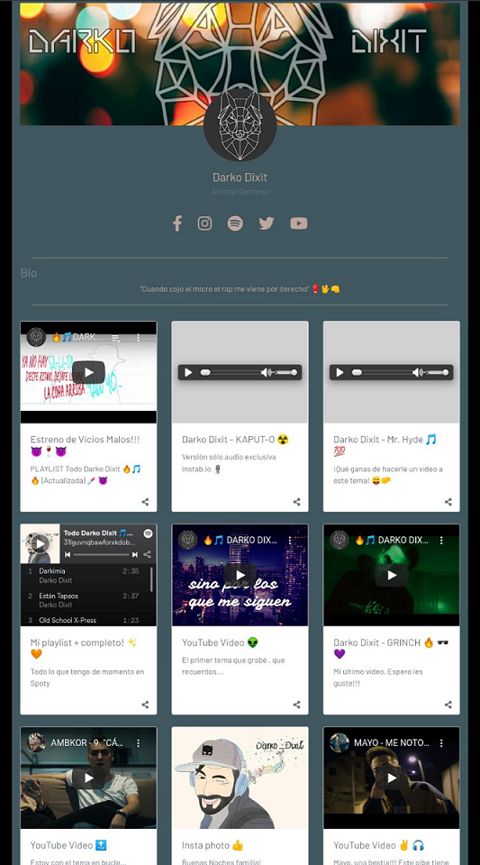

  

# 🤩 [InstaB.io](https://instab.io) 🤩

> [InstaB.io](https://instab.io) is a true WYSIWYG Social Media Portfolio: *One link to link them all!*

# New 🔥 [InstaB.io Blog](https://blog.instab.io) ✍️ just launched!

> Check out 👀 [InstaB.io Blog](https://blog.instab.io) - Find the Guide of Use, upcoming features and news!

---

# Motivation
> Among other reasons, I refuse to change the **only link field available** in the whole *Instagram* ecosystem, **profile´s Bio url** each time I want to share new content 😠

---

# What can I post to 🤩 [InstaB.io](https://instab.io)?
- 💜 **Instagram** posts (any public profile)
- 📺 **YoutTube** videos/playlists
- 🎶 **Spotify** tracks/albums/playlists
- 📷 Remote **Images**
- 🌐 External **links** `http*s*://...` or **iframe widgets** `<iframe src="..."></iframe>`

# How?
Simple, in a nutshell:

1. Visit [InstaB.io](https://instab.io) and login with any social provider

2. [Customise your InstaB.io profile like a pro](https://blog.instab.io/#/guide/customise-your-profile-like-a-pro)

- **Change background and text colors** for your profile
- **Edit source URLs** for both cover and profile pictures
- **Link your profile/channel** for most of the main Social Networks
- **Edit any text field** displayed on the profile
- **Edit the columns layout** for both mobile and desktop browsers
- **Drag and Drop** content cards to swap their positions on the main layout
- **Post new content** such as:
    - 💜 **Instagram** posts (any public profile)
    - 📺 **YoutTube** videos/playlists
    - 🎶 **Spotify** tracks/albums/playlists
    - 📷 Remote **Images**
    - 🌐 External **links** `http(s)://...` or **iframe widgets** `<iframe src="..."></iframe>`

> For a more in-depth explanation on the `editor mode` tools, visit the dedicated post

- [Customise your InstaB.io profile like a pro](https://blog.instab.io/#/guide/customise-your-profile-like-a-pro)
