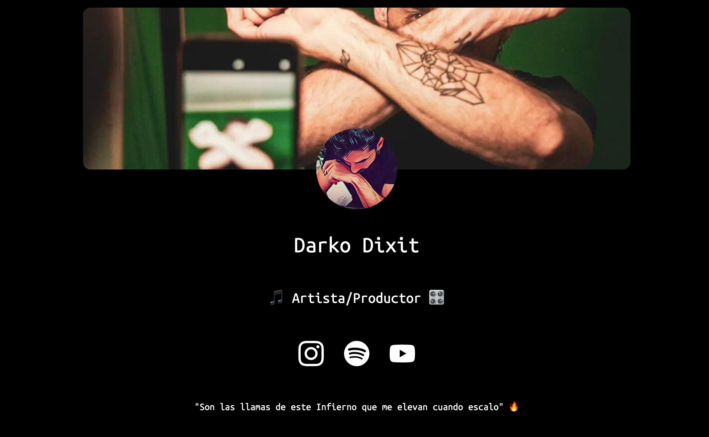
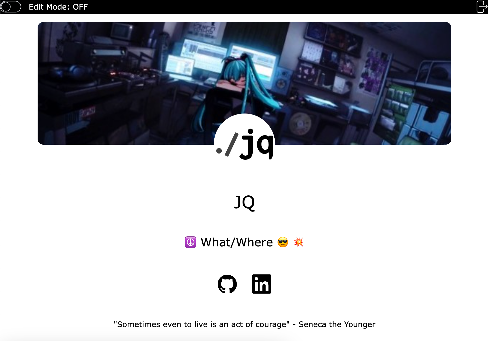
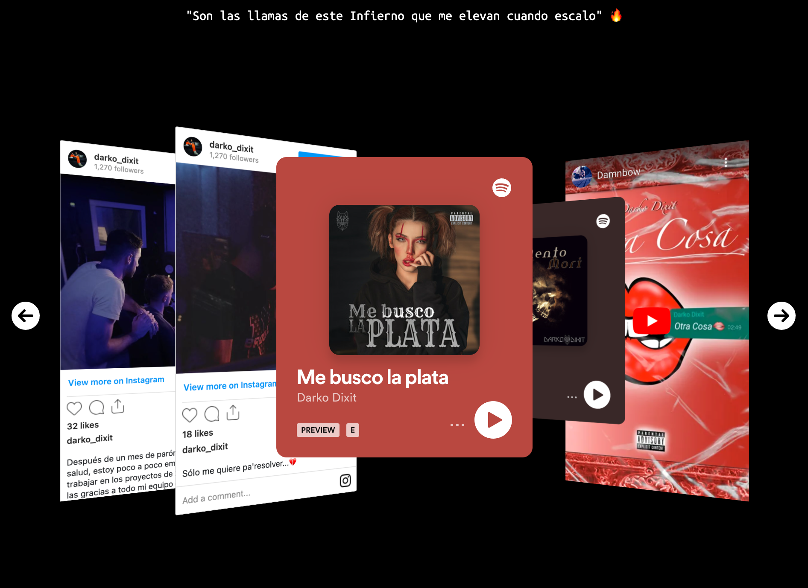
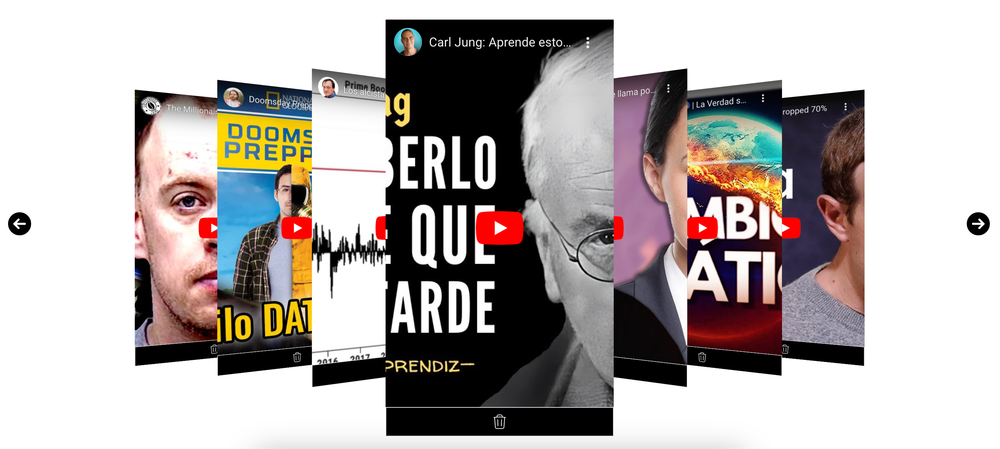
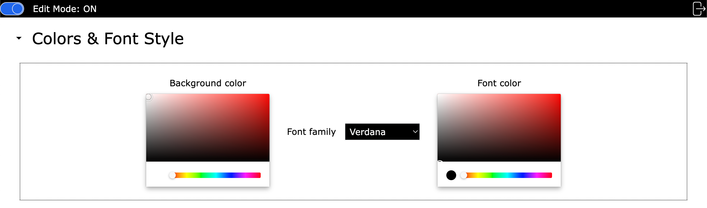
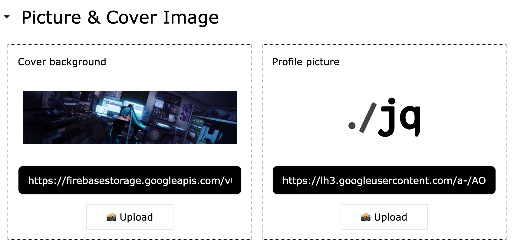
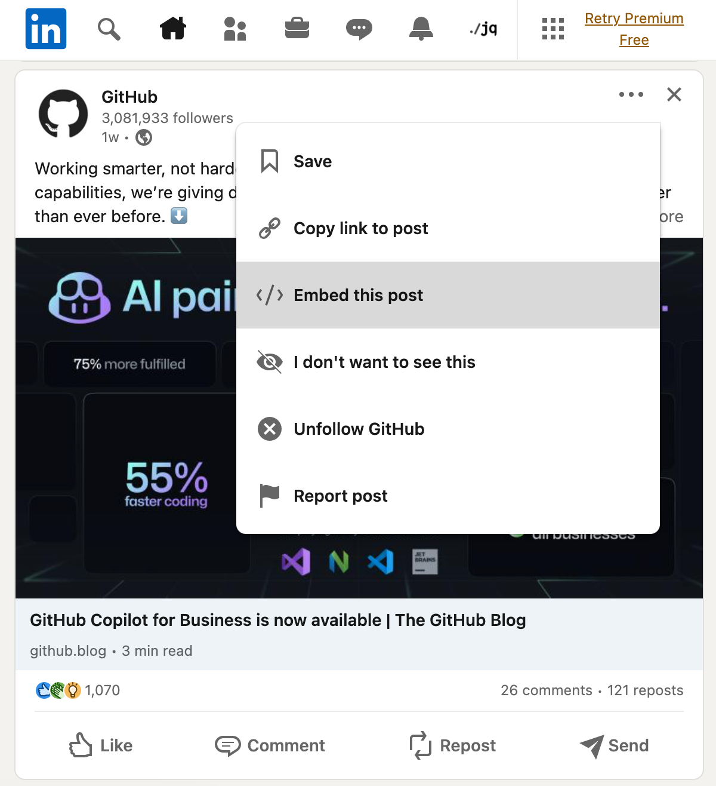
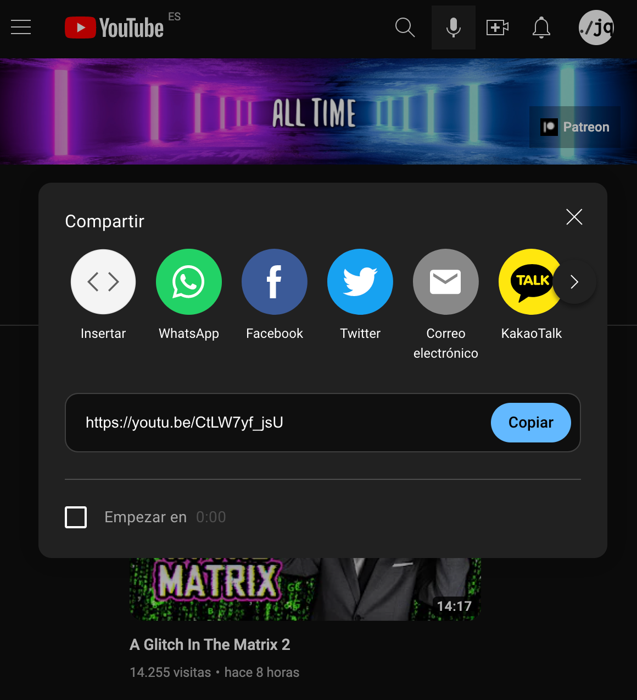
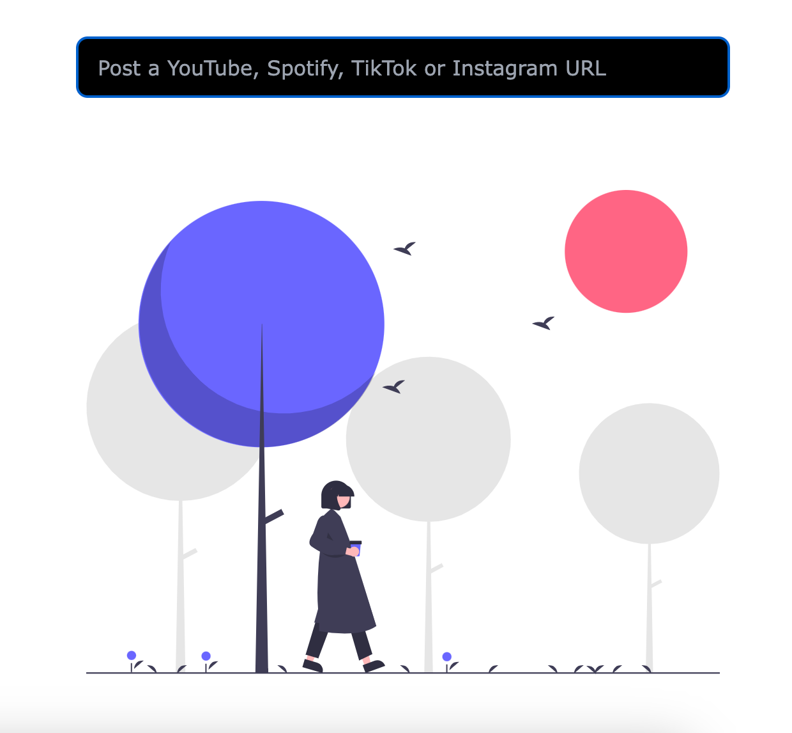
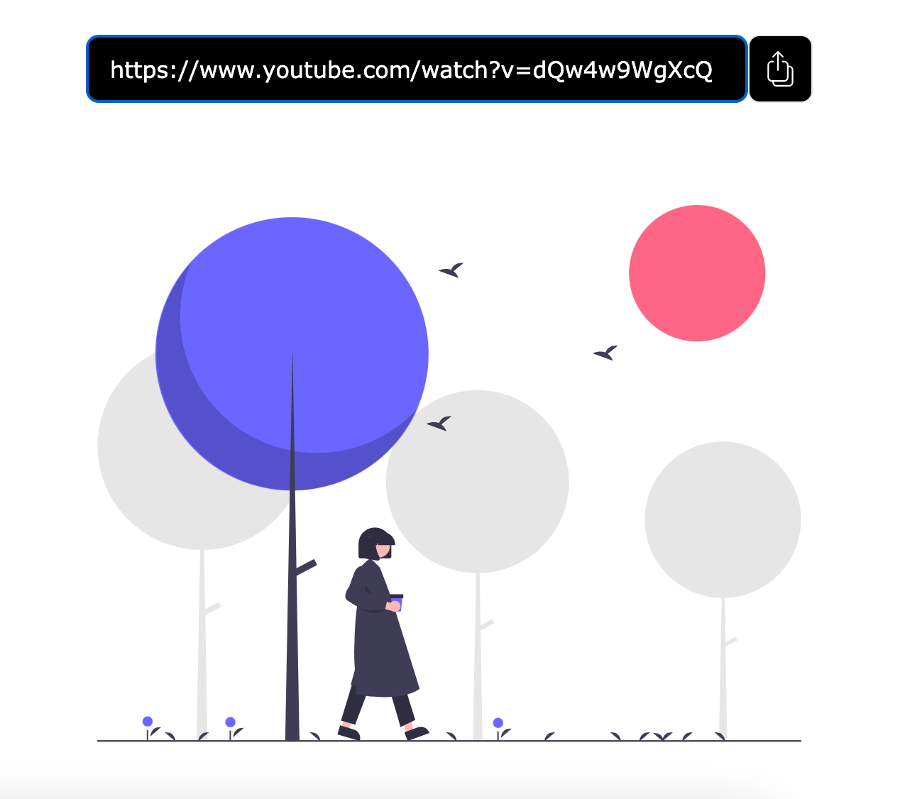

  

# [miportfol.io](https://miportfol.io)
> Your only social showcase

This project comes from the need of a single platform to showcase content from multiple social sources in a unified way.
Many artists, content creators and anyone with enough social content really can benefit from a fully customizable profile where it's easy to highlight their best photos or videos.

After the disruption of internet advertising systems based on users data collection to craft micro-targeted ads we've seen how users have lost control of the sites that represents them. Something similar to the `good ol' MySpace` isn't thinkable today, as the companies would never risk appearing in a random profile filled with content and styles they can't supervise.

I hope [miportfol.io](https://miportfol.io) can work as _"your little own internet corner"_ where you get to choose what colors and font styles better match your persona. A breeze of fresh air in an era where we have so many digital profiles we don't know which one to share when asked for. Link all your profiles at the reach of a click and use the carousel gallery to show-off your best Instagram, YouTube, Spotify or TikTok creations.

# Screenshots

|   |   |
|---|---|
|  |  |
|  |  |
|  |  |

# How does it work?

1.- Make sure you are sharing public content.
> ⚠️ **Posts from private/protected accounts won't work.**

2.- Copy the `share-URL` or `embed-code` for the content you want to share.

|   |   |
|---|---|
|  |  |

3.- Add it to your [MiPortfolio](https://miportfol.io) profile showcase.
|   |   |
|---|---|
|  |  |

# Supported Platforms

As of today the following social sites are supported:

| site | share-URL support | embed-code support |
|---|---|---|
| Facebook | ✅ | ✅ |
| Instagram | ✅ | ✅ |
| LinkedIn | ❌ | ✅ |
| Spotify | ✅ | ✅ |
| TikTok | ✅ | ✅ |
| Twitter | ❌ | ✅ |
| YouTube | ✅ | ✅ |

# FAQ

> Is it free?
- Yes, this is yet another personal side-project with little to no economic cost for now.

> Can I donate to the project?
- No, you can't even "buy me a cofee". No donations accepted until I have to pay the first cent due to actual usage.

> Can I get a custom URI like [miportfol.io/profile/darkodixit](https://miportfol.io/profile/darkodixit) or [miportfol.io/profile/jq](https://miportfol.io/profile/jq)?
- Sure thing! Leave a star in this repo and open an issue with your current profile-id. I will then assign you the profile-name of your choice (as long as it's not taken, obviously).

> Is this an open-source project? If so, where is the source repo?
- Yes, this repo is only hosting the final built of the project. The sources are also hosted on GitHub and it's open to collaborations but the main reason it's not public is security around backend and configs.

> I have some good ideas! Can I collaborate?
- If you want to collaborate, open an issue in this repo requesting it and I will happily make you a member of the source repo. Just make sure you have some familiarity with Vue3 beforehand.

> Can I post any content from any platform?
- No, there are some basic aspects all posts will need to share to be elegible:
    * Be public (belong to a public profile/account)
    * Be posted under one of the currently [supported sites](#supported-platforms)

- Still, you can try embed-codes/URLs from other sites but the result, even if it works, will probably be poor at least design-wise. It's probably better to [open an issue here](https://github.com/yeikiu/miportfol.io-site/issues) to suggest the new platform integration.
