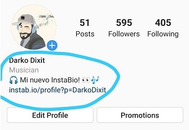

  

# 🤩 [InstaB.io](https://instab.io) 🤩

> [InstaB.io](https://instab.io) is a true WYSIWYG Portfolio: *One link to link them all!*

# New 🔥 [InstaB.io Blog](https://blog.instab.io) ✍️ just launched!

> Check out 👀 [InstaB.io Blog](https://blog.instab.io) - Find the Guide of Use, upcoming features and news!

---

# Motivation
> Among other reasons, I refuse to change the **profile´s Bio url** (which is the **one-and-only link field** in the whole *Instagram* ecosystem) each time I want to share new content 😠

