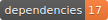

  

# 🤩 [InstaB.io](https://instab.io) 🤩

## Start [your coolest portfolio](https://instab.io) now!

> Stop updating your insta **Bio-Link** (which is the **one-and-only link field** in the whole *Instagram* ecosystem 😠)

---

